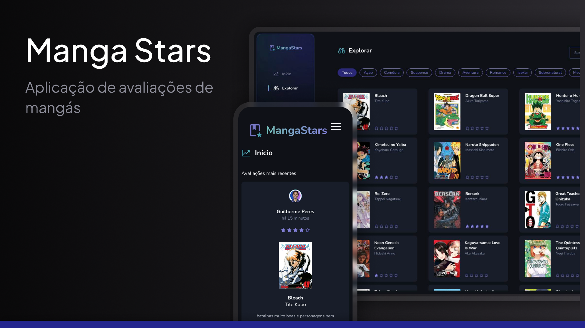

<h1 align="center"><a href="https://manga-stars.vercel.app">Manga Stars</a></h1>

<p align= "center">O Manga Stars é uma aplicação web para avaliação de mangás, desenvolvida como resultado de um estudo aprofundado em React.js e Next.js, com foco em performance, autenticação e experiência do usuário</p>

<p align="center">
<a href="https://manga-stars.vercel.app">🔗 Live App</a>&nbsp;&nbsp;&nbsp;|&nbsp;&nbsp;&nbsp;
<a href="#-projeto">💻 Projeto</a>&nbsp;&nbsp;&nbsp;|&nbsp;&nbsp;&nbsp;
<a href="#-tecnologias">🚀 Tecnologias</a>&nbsp;&nbsp;&nbsp;|&nbsp;&nbsp;&nbsp;
<a href="#-instalação">📦 Instalação</a>

<p align="center">

</p>

## 💻 Projeto

Manga Stars é uma aplicação web para avaliação de mangás, desenvolvida com foco em performance, autenticação e experiência do usuário.

Nele, usuários podem fazer login com Google ou GitHub e deixar avaliações para mangás pré-cadastrados. No primeiro acesso, o cadastro é feito automaticamente no banco de dados PostgreSQL; nos acessos seguintes, os dados do usuário são carregados automaticamente.

A aplicação foi desenvolvida com Next.js, priorizando server-side rendering (SSR) para melhor performance e carregamento. É responsiva, adaptando-se bem a dispositivos móveis, e conta com otimizações de SEO para melhor indexação.

Ao logar, recursos adicionais são desbloqueados, como cards de leitura recente e alertas de novas avaliações.

Sinta-se à vontade para testar e deixar sua avaliação!

## 🚀 Tecnologias

Esse projeto foi desenvolvido com as seguintes tecnologias:

- React e Next.js
- TypeScript
- Prisma ORM e PostgreSQL
- OAuth via Google e GitHub
- Axios
- Zod

## 📦 Instalação

Siga os passos abaixo para rodar o Manga Stars localmente em ambiente de desenvolvimento:

```bash
# Clone o repositório para o diretório desejado
git clone git@github.com:guilhermedkdk/manga-stars.git

# Acesse a pasta do projeto
cd manga-stars

# Instale as dependências do projeto
npm install

# Copie o arquivo de variáveis de ambiente
cp .env.example .env

# Preencha o arquivo .env com as suas credenciais (banco de dados, autenticação, etc.)

# Inicie o servidor de desenvolvimento
npm run dev
```
